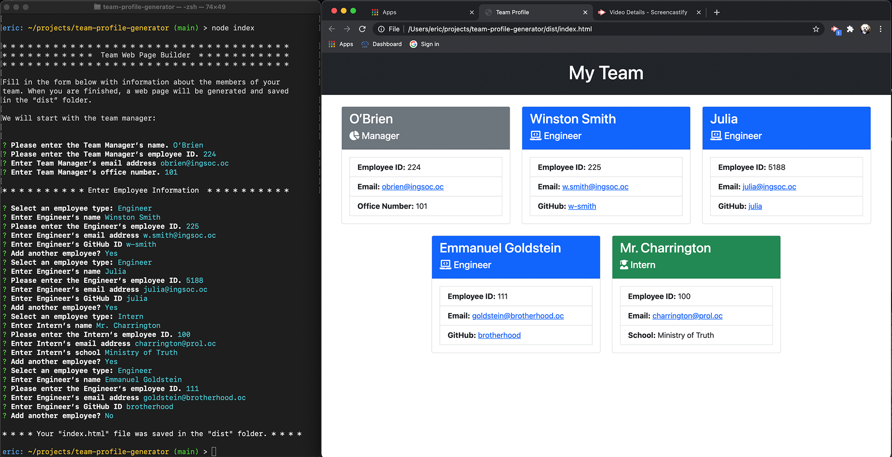

# Team Profile Generator
## Description
Application for creating a team HTML page based on Inquirer inputs.

## Installation
1. [Click here](https://github.com/e-p-n/team-profile-generator) to find the Team Profile Generator repository. Click on the "code" button and copy the link to clone the repo.
2. In your terminal/bash app, navigate to the folder where you want to install Team Profile Generator. Clone the application by typing "git clone" and then pasting the link you copied in step 1.
3. Install the package managers by typing "npm install" in your terminal/bash app. If this works correctly you will have a "node_modules" folder added inside the folder where you have installed the app.

## Usage
1. In your terminal/bash window type "node index" or "node index.js" to launch the app.
2. Answer the question prompts in the terminal/bash window. 
3. Navigate to the "dist" folder inside the app’s main folder. Inside you will find a completed index.html file. The file layout is created with Bootstrap, so there is no need to worry about needing a supporting CSS file.

[Click here](https://drive.google.com/file/d/16G9-Te4LfdgL0QOnN1xxYRtLLrqnA9Zu/view) to watch a step-by-step video.

## Project Location
https://github.com/e-p-n/team-profile-generator